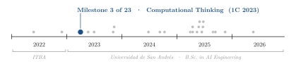

<div align="center">

# A Harvested Fish Population: Minimum Viable Stock and Maximum Sustainable Catch

**Santiago Groba Alonso**

Universidad de San Andrés · *Computational Thinking* · First semester 2023 · Assignment 1

[](#reproducing-the-results)
[](#reproducing-the-results)

<picture>
  <source media="(prefers-color-scheme: dark)" srcset="docs/figures/trajectory-dark.svg">
  
</picture>

</div>

> **Abstract.** The first assignment of my first programming course at UdeSA models the fish population of a lake as a discrete logistic map with predation and a fixed daily catch. Three short Python scripts simulate the population, search for the minimum stock that survives illegal fishing, and search for the largest daily catch that does not wipe the lake out within 90 days. Re-running them against a closed-form equilibrium analysis, the minimum viable population the script finds (125 fish) lands exactly on the model's unstable equilibrium (124.9), while the maximum daily catch it reports (11,111) is sustainable only for the 90 days it simulates: the population dies on day 91, and the true long-run limit is 11,098 fish per day.

---

## 1. Problem

The assignment gives a discrete model for the number of fish $y_t$ in a lake on day $t$,

$$y_{t+1} = y_t + \alpha\, y_t(\beta - y_t) - \gamma\, y_t - x,$$

with reproduction rate $\alpha = 8.2\times10^{-5}$, carrying capacity $\beta = 24\,487$, predation rate $\gamma = 0.1$ and a daily catch $x$, and asks three questions:

1. Simulate the population day by day for given parameters.
2. What is the smallest initial population that survives 90 days of illegal fishing at $x = 237$ fish per day?
3. Starting at 90 % of the carrying capacity, what is the largest daily catch that keeps the population alive for 90 days?

## 2. Methods

| Script | Approach |
|---|---|
| `simulador_de_poblacion.py` | Reads $y_0$, $x$, $\alpha$, $\beta$, $\gamma$ and the number of days from the console, validating every input, and prints the table $(t, y_t)$ |
| `poblacion_minima_viable.py` | Increases $y_0$ one fish at a time until the population is still positive after 90 days with $x = 237$ |
| `maximo_rendimiento_posible.py` | Starts at $y_0 = 0.9\,\beta$ and increases $x$ one fish at a time until the population dies within 90 days; returns the last catch that survived |

The model has a closed-form check. With net growth rate $r = \alpha\beta - \gamma$, equilibria satisfy $\alpha y^2 - r y + x = 0$; they exist only while $x \le r^2 / 4\alpha$, and for a given $x$ the smaller root is an unstable threshold below which the population collapses.

## 3. Results

**Table 1.** Script answers (re-run) against the equilibrium analysis.

| Question | Script (90-day search) | Equilibrium analysis |
|---|---:|---:|
| Minimum viable population for $x = 237$ | 125 fish | unstable equilibrium at 124.9 fish |
| Maximum daily catch from $y_0 = 0.9\,\beta$ | 11,111 fish/day | $r^2/4\alpha = 11\,098$ fish/day |

<p align="center"></p>

**Figure 1.** (a) With $x = 237$, starting one fish below the threshold leads to extinction on day 5, while 125 fish recover to the stable equilibrium (23,143) after a damped oscillation. (b) Days until extinction from $y_0 = 0.9\,\beta$ as a function of the daily catch. Below 11,098 fish/day the population survives indefinitely; the script's answer of 11,111 survives exactly 90 days and dies on day 91, so the 90-day horizon slightly overestimates the sustainable catch.

## 4. Takeaways

- A brute-force search is only as good as its stopping rule: the minimum-population search finds the true threshold, but the maximum-catch search inherits the 90-day horizon of the statement.
- A two-line equilibrium analysis was enough to check both scripts; checking a simulation against a closed form is cheap and catches exactly this kind of off-by-a-horizon answer.

The course's second assignment is [vigenere-cryptanalysis](https://github.com/Santi2065/vigenere-cryptanalysis) and its final project is [hidden-summit-search](https://github.com/Santi2065/hidden-summit-search).

## Reproducing the results

```bash
python poblacion_minima_viable.py       # El lago debe tener 125 peces como minimo ...
python maximo_rendimiento_posible.py    # si se pescan 11111 peces por dia ...
python simulador_de_poblacion.py        # interactive: prompts for y0, x, alpha, beta, gamma and days

pip install matplotlib
python docs/figures/make_figures.py     # regenerates Figure 1 and prints Table 1
```

| File | Content |
|---|---|
| `simulador_de_poblacion.py` | Interactive day-by-day simulator |
| `poblacion_minima_viable.py` | Minimum viable population search |
| `maximo_rendimiento_posible.py` | Maximum daily catch search |
| `docs/figures/` | Script and style used for the figure in this README |

## Citation

```bibtex
@misc{groba2023fish,
  author       = {Groba Alonso, Santiago},
  title        = {A Harvested Fish Population: Minimum Viable Stock and Maximum Sustainable Catch},
  year         = {2023},
  howpublished = {Universidad de San Andr{\'e}s, Computational Thinking},
  url          = {https://github.com/Santi2065/fish-population-harvesting}
}
```
