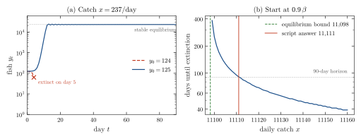

<div align="center">

# First Semester at UdeSA: Computational Thinking Notes and a Harvested-Population Model

**Santiago Groba Alonso**

Universidad de San Andrés · *Computational Thinking* and *Art Appreciation* · First semester 2023 · Course notes and practice

[](#reproducing-the-results)
[](#2-contents)

<picture>
  <source media="(prefers-color-scheme: dark)" srcset="docs/figures/trajectory-dark.svg">
  
</picture>

</div>

> **Abstract.** This repository collects my notes and exercises from my first semester at UdeSA (March–June 2023). Most of it belongs to *Computational Thinking* (Pensamiento Computacional), the introductory programming course: 31 Python files, about 2,500 lines, covering twelve lectures, eight practice guides, tutorials and problem classes, from Boolean logic to recursion and object-oriented programming, plus a closing lecture on C. The first assignment (TP 1) models the fish population of a lake as a discrete logistic map with harvesting; re-running it, the brute-force search for the minimum viable population (125 fish) lands on the model's unstable equilibrium (124.9), while the maximum daily catch it reports (11,111) is sustainable only for the 90 days it simulates: the long-run limit is 11,098. The second assignment and the final project have their own repositories. Notes for an *Art Appreciation* course (art and music history) and a short shell script complete the log.

---

## 1. Courses

- **Computational Thinking** (*Pensamiento Computacional*). Introductory programming in Python: types and Boolean logic, control flow, functions, sequences and dictionaries, files, searching and sorting, recursion, object-oriented programming, debugging, testing and exceptions, and a first look at C. The course work in this log includes two assignments (TPs) and a final project.
- **Art Appreciation** (*Apreciación artística*). Plain-text and LaTeX notes on art and music history: the Baroque (painting, sculpture and music), Classicism and Romanticism, the separation of instrumental from vocal music, and twentieth-century music from Schoenberg and expressionism onwards.

## 2. Contents

**Table 1.** Map of the repository. Lecture and guide topics are taken from the file names and the headers inside each file.

| Folder | Material | Topics |
|---|---|---|
| `pc/Teoricas/` | Lectures 1–4, 6–13 | 1 intro to Python · 2 binary logic and operators · 3 loops · 4 functions · 6 sequences · 7 files · 8 search algorithms · 9 sorting · 10 recursion · 11 object-oriented programming (`Lavarropas`, `circle`, `vector`) · 12 debugging, testing and exceptions · 13 C data types |
| `pc/Practicas/` | Practice guides 2–9 | 2 Boolean logic and conditionals · 3 loops (multiplication by repeated sums, Gauss sum) · 4 functions · 5 strings and sequences · 6 dictionaries · 7 files (`less`, `head`) · 8 recursion (Peano-style sum, product, power) · 9 classes (`point`, `triangle`, `rectangle`) |
| `pc/Tutorial/` | Tutorials 2, 4, 6, 7 | conditionals, digit manipulation, string functions, dictionary lookups |
| `pc/Clase de Problemas/` | Problem classes 1–3 | short warm-up exercises |
| `pc/Tp1/` | Assignment 1 | fish-population simulator, minimum viable population, maximum sustainable catch |
| `TP_2_PC` | Assignment 2 | git submodule pointing to [Vigenere-Cipher](https://github.com/Santi2065/Vigenere-Cipher) |
| `Apreciacion artistica/` | Art Appreciation | art and music history notes (`.txt`, and a LaTeX handout with its PDF) |
| `hackingLearn/ipsweeper.sh` | Side exercise | a three-line Bash ping sweep over a /24 network |

The final project of *Computational Thinking*, a strategy for a multi-client climbing competition on a simulated terrain, is in [Terrain-Navigation-Algorithm](https://github.com/Santi2065/Terrain-Navigation-Algorithm).

<p align="center"></p>

**Figure 1.** Pace of the semester from `git log`: each dot is the date a file first entered the repository, labelled with the lecture, guide or tutorial number. The first upload (30 March) brought in the material of the first weeks; afterwards lectures and guides were committed roughly as the course advanced.

## 3. Assignment 1: harvested fish population

The assignment gives a discrete model for the number of fish $y_t$ in a lake on day $t$,

$$y_{t+1} = y_t + \alpha\, y_t(\beta - y_t) - \gamma\, y_t - x,$$

with reproduction rate $\alpha = 8.2\times10^{-5}$, carrying capacity $\beta = 24\,487$, predation rate $\gamma = 0.1$ and a daily catch $x$. Three scripts answer three questions: `simulador_de_poblacion.py` prints the table $(t, y_t)$ for user-supplied parameters; `poblacion_minima_viable.py` increases $y_0$ one fish at a time until the population survives 90 days with an illegal catch of $x = 237$; and `maximo_rendimiento_posible.py` starts at $0.9\,\beta$ and increases $x$ until the population dies within 90 days.

The model has a closed-form check. With net growth rate $r = \alpha\beta - \gamma$, equilibria satisfy $\alpha y^2 - r y + x = 0$; they exist only while $x \le r^2 / 4\alpha$, and for a given $x$ the smaller root is an unstable threshold below which the population collapses.

**Table 2.** Script answers (run in this session) against the equilibrium analysis.

| Question | Script (90-day search) | Equilibrium analysis |
|---|---:|---:|
| Minimum viable population for $x = 237$ | 125 fish | unstable equilibrium at 124.9 fish |
| Maximum daily catch from $y_0 = 0.9\,\beta$ | 11,111 fish/day | $r^2/4\alpha = 11\,098$ fish/day |

<p align="center"></p>

**Figure 2.** (a) With $x = 237$, starting one fish below the threshold leads to extinction on day 5, while 125 fish recover to the stable equilibrium (23,143) after a damped oscillation. (b) Days until extinction from $y_0 = 0.9\,\beta$ as a function of the daily catch. Below 11,098 fish/day the population survives indefinitely; the script's answer of 11,111 survives exactly 90 days and dies on day 91, so the 90-day horizon slightly overestimates the sustainable catch.

## 4. Takeaways

- A brute-force search is only as good as its stopping rule: the minimum-population search finds the true threshold, but the maximum-catch search inherits the 90-day horizon of the statement.
- A two-line equilibrium analysis was enough to check both scripts; checking a simulation against a closed form is cheap and catches exactly this kind of off-by-a-horizon answer.
- Committing lecture notes as runnable `.py` files, rather than prose, made the course material easy to revisit.

## Reproducing the results

```bash
cd pc/Tp1
python poblacion_minima_viable.py       # El lago debe tener 125 peces como minimo ...
python maximo_rendimiento_posible.py    # si se pescan 11111 peces por dia ...
python simulador_de_poblacion.py        # interactive: prompts for y0, x, alpha, beta, gamma and days
cd ../..

pip install matplotlib
python docs/figures/make_figures.py     # regenerates Figures 1-2 and prints Table 2 (uses git log)
```

| File | Content |
|---|---|
| `pc/` | Computational Thinking: lectures, guides, tutorials, problem classes and TP 1 |
| `pc/Practicas/pepe` | Loose exercises (substring search in a DNA string, interest rates) |
| `TP_2_PC` | Submodule pointer to the second assignment ([Vigenere-Cipher](https://github.com/Santi2065/Vigenere-Cipher)) |
| `Apreciacion artistica/` | Art Appreciation notes |
| `hackingLearn/` | Bash ping-sweep script |
| `docs/figures/` | Script and style used for the figures in this README |

## Citation

```bibtex
@misc{groba2023udesa,
  author       = {Groba Alonso, Santiago},
  title        = {First Semester at UdeSA: Computational Thinking Notes and a Harvested-Population Model},
  year         = {2023},
  howpublished = {Universidad de San Andr{\'e}s, Computational Thinking},
  url          = {https://github.com/Santi2065/UDESA}
}
```
